# 🌐 Lab-Redes: Laboratório de Aplicações Distribuídas e Protocolos de Rede

Este repositório contém a implementação prática de quatro modelos fundamentais de comunicação em rede: **TCP**, **UDP**, **Multicast** e **WebSockets**. O projeto foi desenvolvido como parte do laboratório de desenvolvimento de aplicações móveis e distribuídas, contendo implementações paralelas e funcionais em **Java** e **Python**. 

O principal objetivo deste projeto é explorar a comunicação multiplataforma (cross-communication) entre diferentes linguagens de programação e entender na prática as nuances de sockets e redes em sistemas operacionais distintos, incluindo a superação de limitações de multicast em ambientes macOS.

---

## 📁 Estrutura do Projeto

A organização dos diretórios do repositório está disposta da seguinte forma:

```text
.
├── 📂 atividade/            # Arquivos do roteiro da atividade prática e slides de apoio
│   ├── 📂 roteiro/
│   └── 📂 slide/
├── 📂 evidencias/           # Capturas de tela que comprovam o funcionamento de cada protocolo
│   ├── 📂 tcp/
│   ├── 📂 udp/
│   ├── 📂 multicast/
│   └── 📂 websocket/
├── 📂 java/                 # Códigos-fonte da implementação em Java
│   ├── 📂 tcp/              # Servidor e Cliente TCP simples
│   ├── 📂 udp/              # Servidor e Cliente UDP
│   ├── 📂 multicast/        # Comunicação de grupo com ajustes de interface
│   └── 📂 websocket/        # Projeto do mural WebSocket estruturado com Maven
├── 📂 python/               # Códigos-fonte da implementação em Python
│   ├── 📂 tcp/              # Servidor e Cliente TCP (com comando 'hora')
│   ├── 📂 udp/              # Servidor e Cliente UDP
│   ├── 📂 multicast/        # Transmissão e escuta multicast local
│   └── 📂 websocket/        # Mural em tempo real usando asyncio/websockets
├── 📄 LICENSE               # Licença MIT aplicável ao código do projeto
├── 📄 RESPOSTAS.md          # Relatório técnico contendo as respostas às questões do roteiro
└── 📄 README.md             # Documentação de apresentação e instrução do projeto
```

---

## 🚀 Tecnologias Utilizadas

### Linguagens e Ambientes
*   **Java 17** (Utilizando sockets nativos, `java.net`, threads e Maven para gerenciamento de dependências).
*   **Python 3.10+** (Utilizando as bibliotecas nativas `socket`, `struct` e a biblioteca assíncrona `asyncio`).

### Protocolos e Comunicação
*   **TCP (Transmission Control Protocol)**: Sockets de fluxo orientados a conexão e confiáveis. Adicionada uma funcionalidade customizada de resposta de horário do servidor (`hora`) e encerramento (`sair`).
*   **UDP (User Datagram Protocol)**: Canal de datagramas não orientado a conexão, focado em baixo atraso e sem garantias de entrega.
*   **Multicast IP**: Comunicação em grupo de um-para-muitos sob o endereço de grupo `230.0.0.1` e porta calculada via deslocamento dinâmico (offset **74**, totalizando porta `4520`).
*   **WebSockets**: Protocolo de comunicação bidirecional de baixa latência estabelecido a partir de um handshake HTTP, permitindo a criação de um mural de mensagens persistente e em tempo real.
    *   **Java WebSocket Dependency**: [`Java-WebSocket (v1.5.6)`](https://github.com/TooTallNate/Java-WebSocket) gerenciado no Maven.
    *   **Python WebSocket Dependency**: [`websockets`](https://websockets.readthedocs.io/) com suporte assíncrono.

---

## 🛠️ Como Executar o Projeto

Certifique-se de ter o **Java JDK 17+**, **Maven**, **Python 3+** e o gerenciador de pacotes **pip** instalados na sua máquina.

### Instalação de Dependências (WebSockets)
Antes de testar a parte de WebSockets, instale os pacotes e dependências necessárias:

```bash
# Para a versão em Python
pip install websockets

# Para a versão em Java (Maven)
cd java/websocket
mvn clean compile
```

---

### 1️⃣ TCP (Transmission Control Protocol)
O servidor e o cliente TCP estabelecem conexão de fluxo de bytes. O servidor escuta na porta `5074` e reage aos comandos `"hora"` (mostra o horário do servidor) e `"sair"` (desconecta).

#### Em Python:
```bash
# Terminal 1: Iniciar o Servidor
python python/tcp/servidor_tcp.py

# Terminal 2: Iniciar o Cliente
python python/tcp/cliente_tcp.py
```

#### Em Java:
```bash
# Compilar os arquivos Java
javac java/tcp/ServidorTCP.java java/tcp/ClienteTCP.java

# Terminal 1: Iniciar o Servidor
java -cp java/tcp ServidorTCP

# Terminal 2: Iniciar o Cliente
java -cp java/tcp ClienteTCP
```

---

### 2️⃣ UDP (User Datagram Protocol)
Sockets baseados em envio e recebimento de datagramas avulsos e sem conexão estabelecida. O servidor escuta na porta `5075`.

#### Em Python:
```bash
# Terminal 1: Iniciar o Servidor
python python/udp/servidor_udp.py

# Terminal 2: Iniciar o Cliente
python python/udp/cliente_udp.py
```

#### Em Java:
```bash
# Compilar os arquivos Java
javac java/udp/ServidorUDP.java java/udp/ClienteUDP.java

# Terminal 1: Iniciar o Servidor
java -cp java/udp ServidorUDP

# Terminal 2: Iniciar o Cliente
java -cp java/udp ClienteUDP
```

---

### 3️⃣ Multicast (Comunicação de Grupo)
O servidor transmite 5 avisos periódicos para um grupo de transmissão no endereço `230.0.0.1` e porta `4520` (calculada como 4446 + 74 de offset). Todos os clientes inscritos no mesmo grupo recebem as mensagens instantaneamente.

> [!IMPORTANT]
> **Ajuste para macOS:** Durante os testes em macOS, observou-se um problema de roteamento multicast padrão que impedia a entrega das mensagens localmente. A correção implementada consiste em configurar os sockets multicast explicitamente para a interface de rede loopback local (`127.0.0.1`), usando `IP_MULTICAST_IF` no Python e `setNetworkInterface` no Java, além de configurar `java.net.preferIPv4Stack` como `true` no Java.

#### Em Python:
```bash
# Terminal 1: Iniciar o Cliente (Inscrito no grupo multicast à espera)
python python/multicast/cliente_multicast.py

# Terminal 2: Iniciar o Servidor (Que transmite os avisos periódicos)
python python/multicast/servidor_multicast.py
```

#### Em Java:
```bash
# Compilar os arquivos Java
javac java/multicast/ServidorMulticast.java java/multicast/ClienteMulticast.java

# Terminal 1: Iniciar o Cliente
java -cp java/multicast ClienteMulticast

# Terminal 2: Iniciar o Servidor
java -cp java/multicast ServidorMulticast
```

---

### 4️⃣ WebSockets (Mural em Tempo Real)
Implementação de um mural escolar persistente com comunicação em tempo real. O servidor replica todas as mensagens enviadas por um cliente para todos os demais conectados.

*   **Porta Java (MuralServidor)**: `8961` (8887 + 74 de offset)
*   **Porta Python (mural_servidor)**: `8962` (8888 + 74 de offset)

#### Em Python:
```bash
# Terminal 1: Iniciar o Servidor
python python/websocket/mural_servidor.py

# Terminal 2: Iniciar o Cliente
python python/websocket/mural_cliente.py
```

#### Em Java (usando Maven):
```bash
cd java/websocket

# Terminal 1: Iniciar o Servidor
mvn exec:java -Dexec.mainClass="MuralServidor"

# Terminal 2: Iniciar o Cliente
mvn exec:java -Dexec.mainClass="MuralCliente"
```

---

## 📸 Evidências de Funcionamento

Abaixo estão registrados os capturas de tela (screenshots) das execuções do laboratório, demonstrando a comunicação local e interoperabilidade multiplataforma.

### 🔹 TCP
Conexão persistente de fluxo de bytes com resposta a comandos como `"hora"`. O projeto foi testado e validado com sucesso de maneira cruzada (ex: cliente Java conectando-se ao servidor Python).
| Execução Java TCP | Execução Python TCP |
| :---: | :---: |
| 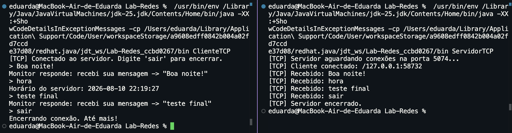 | 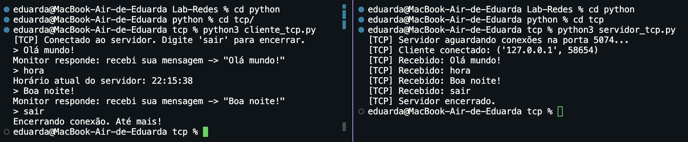 |

---

### 🔹 UDP
Envio rápido de datagramas individuais.
| Execução Java UDP | Execução Python UDP |
| :---: | :---: |
| 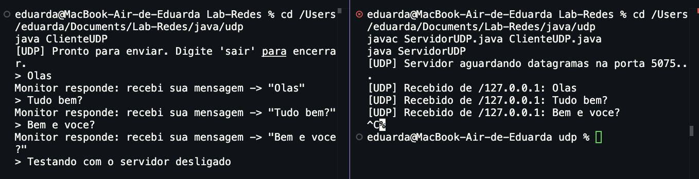 | 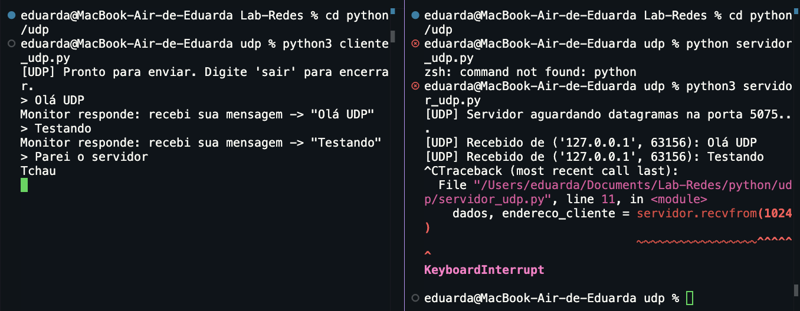 |

---

### 🔹 Multicast e Comunicação Cruzada
Demonstração das mensagens transmitidas ao grupo e recebidas simultaneamente, bem como a resolução do comportamento padrão de rede local.

| Combinação Cruzada (Servidor Java -> Cliente Python) | Combinação Cruzada (Servidor Python -> Cliente Java) |
| :---: | :---: |
| 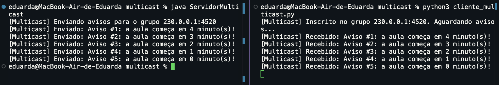 | 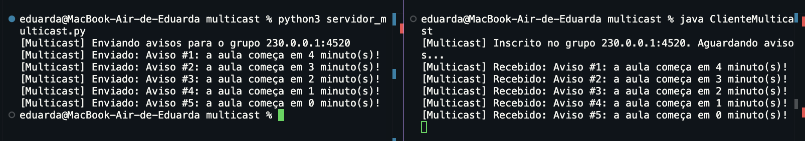 |

| Cliente Multicast Java | Cliente Multicast Python |
| :---: | :---: |
| 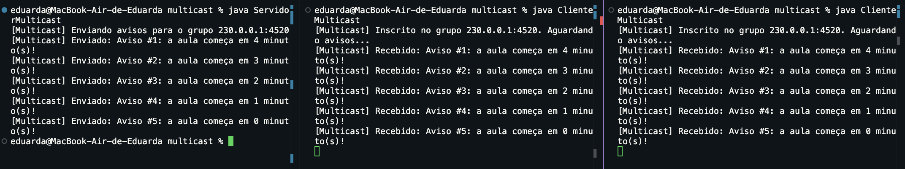 | 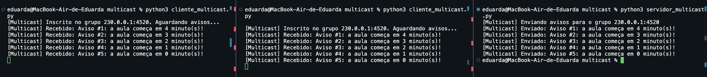 |

> [!TIP]
> **Resolução de Erro de Rota no macOS:**
> 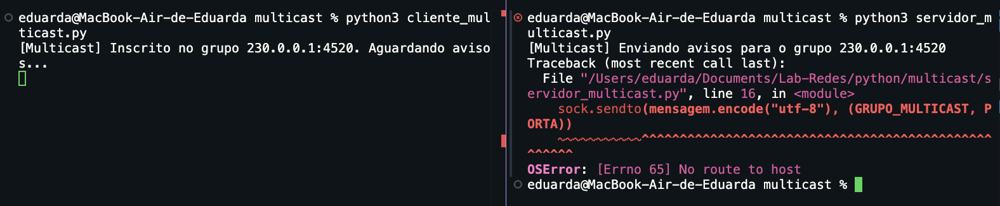
> *O erro inicial de rede multicast em ambiente macOS foi superado realizando o bind explícito à interface local `127.0.0.1` tanto no código Python quanto no código Java.*

---

### 🔹 WebSockets
Mural dinâmico de troca de mensagens bidirecional sobre conexões persistentes WebSocket.
| Mural Java WebSocket | Mural Python WebSocket |
| :---: | :---: |
| 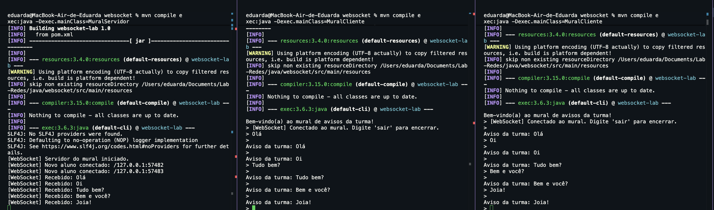 | 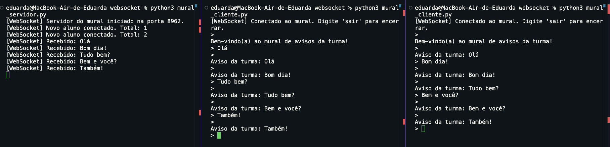 |

---

## 🤖 Uso de Inteligência Artificial

Durante o planejamento, desenvolvimento e solução de problemas de rede do laboratório, fez-se o uso estratégico de assistentes virtuais de IA:

1.  **GitHub Copilot**:
    *   Utilizado de forma ágil para aceleração da digitação do código-fonte e autocomplete de sintaxe.
    *   Aplicado para pequenas adaptações funcionais e customizações, como a rápida criação lógica de formatação da data e hora local do servidor em resposta à palavra-chave `"hora"` na conexão TCP.
2.  **ChatGPT**:
    *   Utilizado principalmente para formatação e revisão das respostas e conteúdos produzidos durante o desenvolvimento e documentação.
    *   Também empregado para consultas rápidas e contextualização teórica sobre comportamentos específicos de protocolos e diagnóstico de problemas (ex: rota multicast no macOS).
3.  **Antigravity (Google Gemini)**:
    *   Utilizado como assistente de desenvolvimento e escrita para planejar e estruturar o design geral do projeto, tendo sido responsável pela criação deste README.md.

---

## 👥 Autores

| 👤 Nome                  | 🖼️ Foto | :octocat: GitHub | 💼 LinkedIn | 📤 Gmail |
| :--- | :---: | :---: | :---: | :---: |
| **Eduarda Vieira Gonçalves** | <div align="center"></div> | <div align="center"><a href="https://github.com/eduardavieira-dev" target="_blank"></a></div> | <div align="center"><a href="https://www.linkedin.com/in/eduarda-vieira-gon%C3%A7alves-01a584297/" target="_blank"></a></div> | <div align="center"><a href="mailto:eduarda.vieira.goncalves7@gmail.com"></a></div> |

---

## 📄 Licença

Este projeto está sob a licença **MIT**. Consulte o arquivo [LICENSE](!file:///Users/eduarda/Documents/Lab-Redes/LICENSE) para obter mais detalhes.
